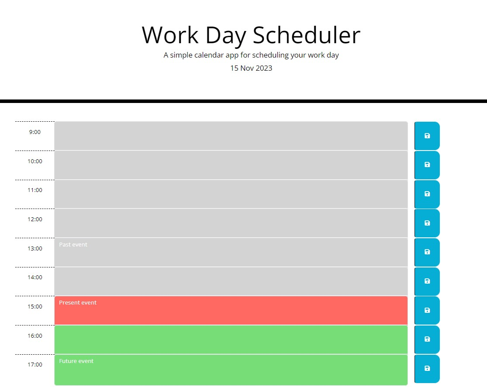

# Daily Scheduler

## Description

Web application allowing the user to organise their work day.

Along with viewing the current day, the user can write, save and keep their planned events for each timeslot stored in the webpage for later viewing.

### Visual 

## Installation
No installation needed. 

## Usage
The page can be accessed through the [following link](https://dsciocan.github.io/daily-schedule).

The page displays the current date at the top, and contains time slots for usual working hours (9 - 17), color coded based on whether they are in the past, present or future. 

Clicking on a specific time slot allows the user to input any events they may want to store, then save the information for later viewing by pressing the save button next to the specific time slot. 

Note: past events cannot be edited.

## Credits
Starter code from [Boot Camp Gitlab](https://git.bootcampcontent.com/uk-edx-16-week/UK-VIRT-FE-PT-09-2023-U-LOLC).

## License
License information is available in the [License](LICENSE) file.
